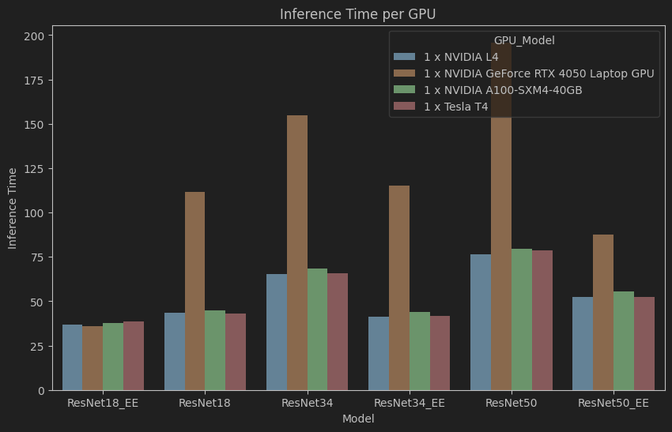

# ResNet Early-Exiting Experiment

## What is early exiting?

Early exiting lets models stop computation once confident, reducing inference time, scaling effort to input complexity, and avoiding overthinking. While first explored in NLP and vision DNNs, it now shows promise in foundation and reasoning models, including BERT, LLaMA, and ViT.

## Results

### Exit Distribution

### FLOPs per Exit Layer

### Average FLOPs per sample

### Energy Consumption per GPU

### Inference Time per GPU

### Emissions per GPU

